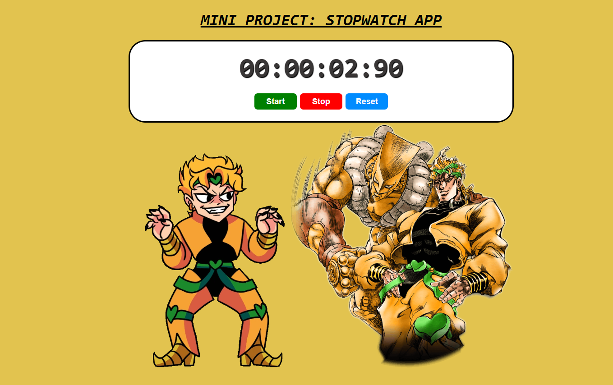

## ⏱️ Dio Stopwatch App Project:

- A JoJo's Bizarre Adventure-inspired stopwatch featuring Dio Brando and The World, allowing users to time events with a stylish and anime-themed design.

## 😧 Features:
- ⏳ Start, Stop, and Reset Stopwatch with responsive controls that, when clicked, have sound effects.
- 🎭 JoJo Anime Theme featuring Dio Brando and The World.
- 🎨 Dynamic UI Design with a themed background and smooth animations.

##  📸 Screenshot: 
- 

##  🌍 LIVE DEMO:
- Try it Out: https://chrisw0987.github.io/dio-stopwatch-app/

## 🛠 Tech Stack:
- **Frontend:** React.js, Vite
- **Styling:** CSS, Animations
- **Tools**: GitHub, VS Code


## 📦 Installation:
1. Clone the repository:
   ```bash
   git clone https://chrisw0987.github.io/dio-stopwatch-app/
2. cd dio-stopwatch-app
3. npm install
4. npm run dev
